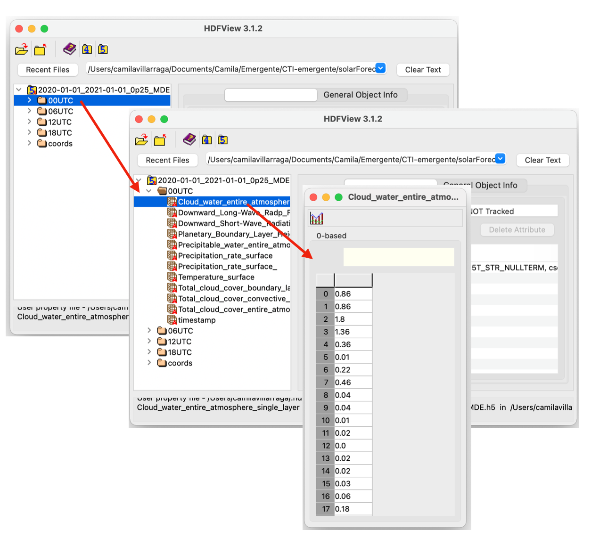
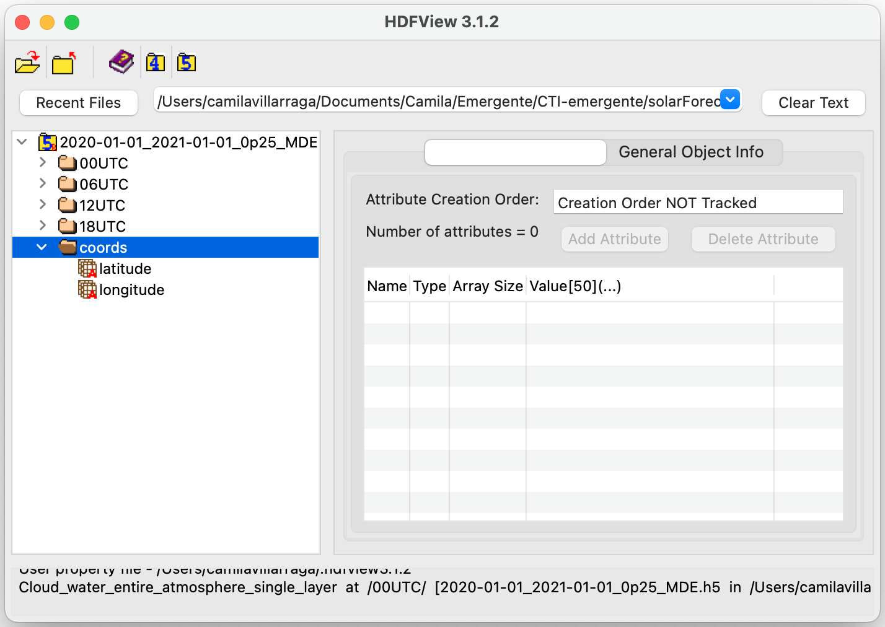
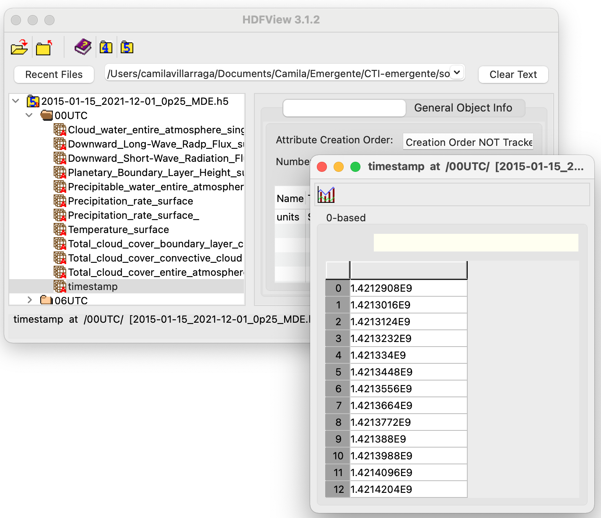
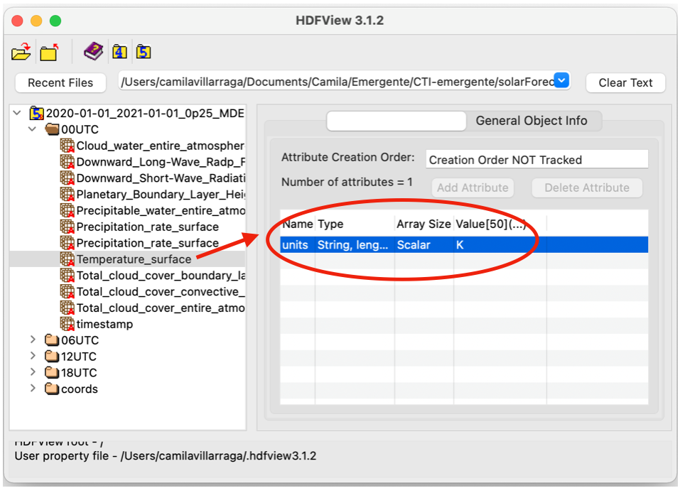

# Post-processing of GFS Meteorological Data

The post-processing of GFS datasets after the acquisition process involves the handling of h5 output files for different requirements such as:

- Timerange merging
- Data resampling using temporal and/or spatial interpolation 
- Data visualization
- Calculation of derived parameters (such as clear sky model calculation)
- Quality checks

A tutorial exemplifying these tools can be seen [here](./posproc.ipynb)

## Hierarchy of h5 files with retrieved GFS products

Output files from the GFS acquisition process are files in format h5 containing the forecasted meteorological data for each runtime at 00UTC, 06UTC, 12UTC, and 18UTC. 
	
For each runtime, data is collected by parameters and organized chronologically by its forecast hour of product.

||
|:--:| 
| Fig.1 H5 file - Structure |

Domain or site coordinates are stored independently.

||
|:--:| 
| Fig.2 H5 file - Domain/Site coordinates storage |

A dataset with the corresponding timestamp is also contained in EPOCH units.

||
|:--:| 
| Fig.3 H5 file - Timestamp dataset |

Datasets attributes includes the units of each parameters at each forecast runtime.

||
|:--:| 
| Fig.4 H5 file - Units as dataset attribute |

### Handling retrieved data

The reading of the generated h5 files with the retrieved data from the GFS prediction model as well as, simpler tasks for handling datasets and enclosed data is described [here](./handling.ipynb)
